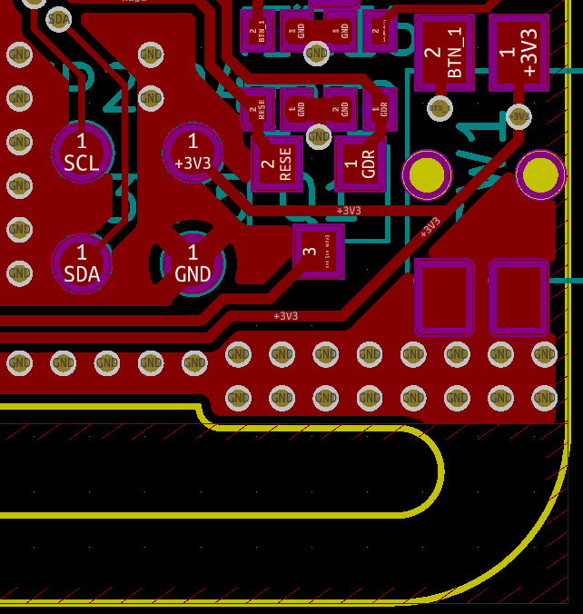
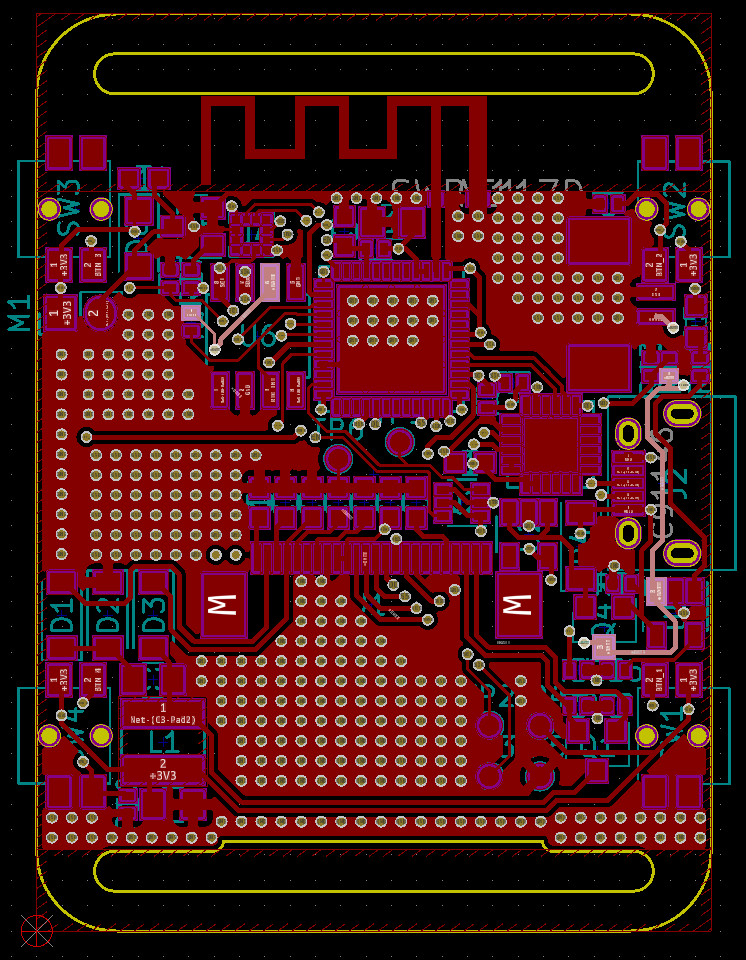
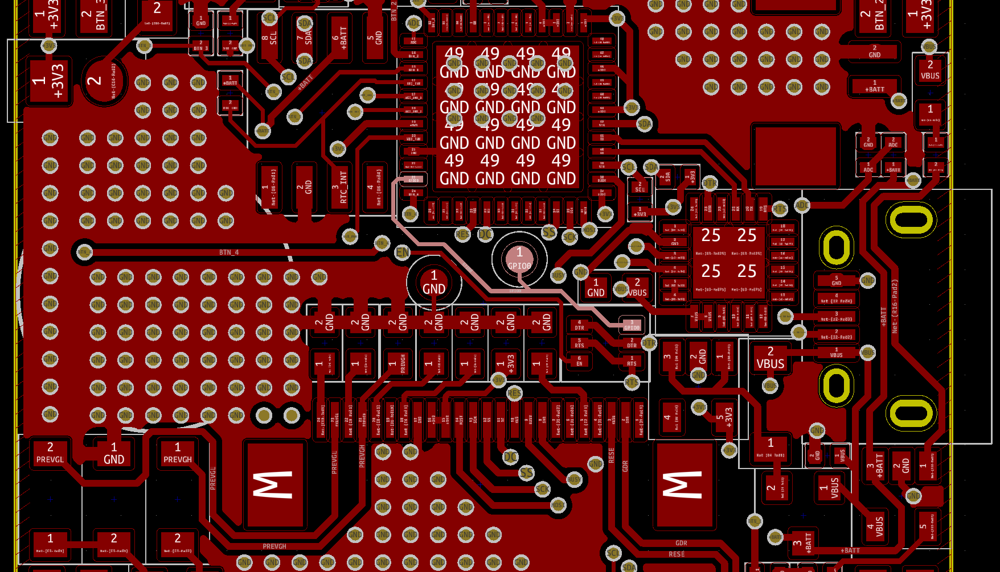
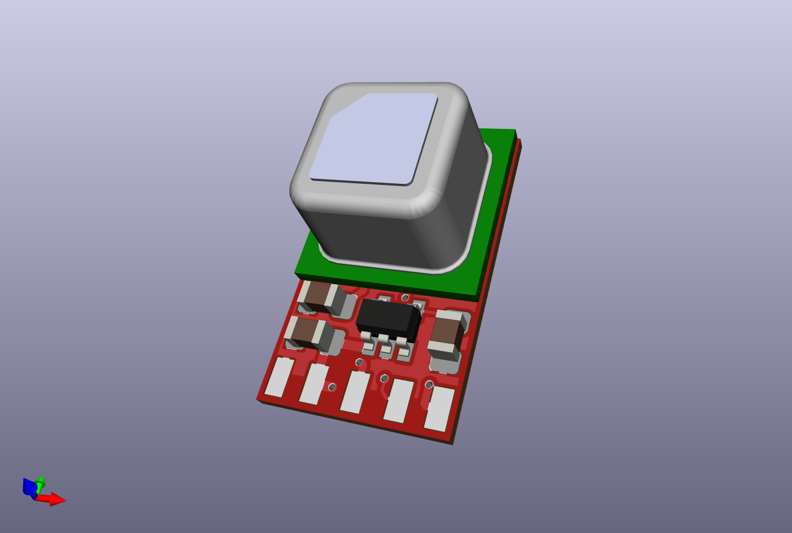
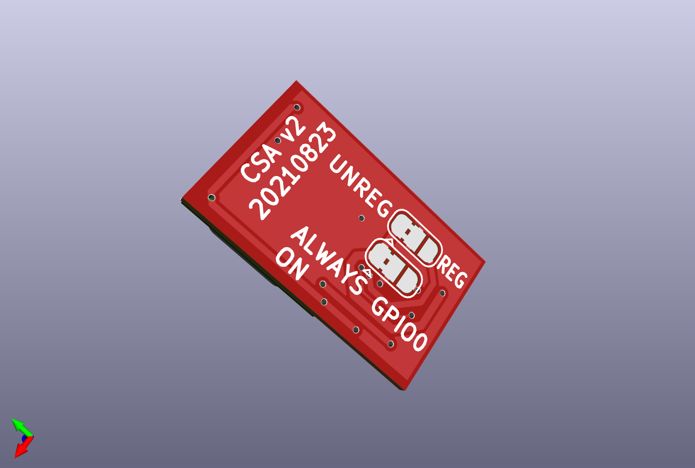

watchy-co2-pcb
==============
A small 10.3mm x 17mm PCB to mount the
[Sensirion SCD40 CO2 sensor](https://www.sensirion.com/en/environmental-sensors/carbon-dioxide-sensors/carbon-dioxide-sensor-scd4x/)
on.  It contains footprints to optionally add a
[3.3v LDO regulator](https://www.njr.com/electronic_device/PDF/NJM2881_NJM2882_E.pdf)
and some extra capacitors to better decouple the
power supply, and a solder jumper (JP2) to allow disabling power to the SCD40
via GPIO to save some additional power.

The SCL/SDA/GND inputs should be wired to the appropriate test
points on the Watchy, as shown below.

For Vin, there are three options:

1. The Vin input can either be connected to the 3.3V test point above,
with JP1 in its default position.  This shares the 3.3V power supply with
the main ESP32.  It may (or may not) be too noisy for best SCD40 accuracy.

2. The Vin input can be connected directly to the battery, +BAT
at one of the positions highlighted below. JP1 would be left in its
default position.  This provides the best battery efficiency, and the
SCD40 can tolerate the higher voltage level, but (depending on the
battery internal resistance) again may be too noisy for best SCD40
accuracy.

3. The Vin input can be connected directly to the battery, and JP1
moved to its alternate position.  This powers the SCD40 by its own
dedicated LDO regulator, ensuring the quietest possible power supply.
In this configuration you can swap JP2 as well and wire
up GPIO0 to control the power to the SCD40.  See below for the test
point location which provides access to GPIO0.

The CP1 and CP3 capacitors will provide useful decoupling in all three
configurations, although (depending on noise measurements) they may
not be required.  The CP2 capacitor and U2 are only required in
configuration three.

Here's a [digikey link](https://www.digikey.com/short/t87dq9r9) for all
components.

This board was designed using kicad 5.

(See also [this doc from TI](https://www.ti.com/lit/an/scaa048/scaa048.pdf)
on decoupling techniques using a ferrite bead if further noise reduction
is necessary.  The
[Sensirion datasheet for the SCD40](https://www.sensirion.com/fileadmin/user_upload/customers/sensirion/Dokumente/9.5_CO2/Sensirion_CO2_Sensors_SCD4x_Datasheet.pdf) suggests less than 30mV of power supply noise.)
