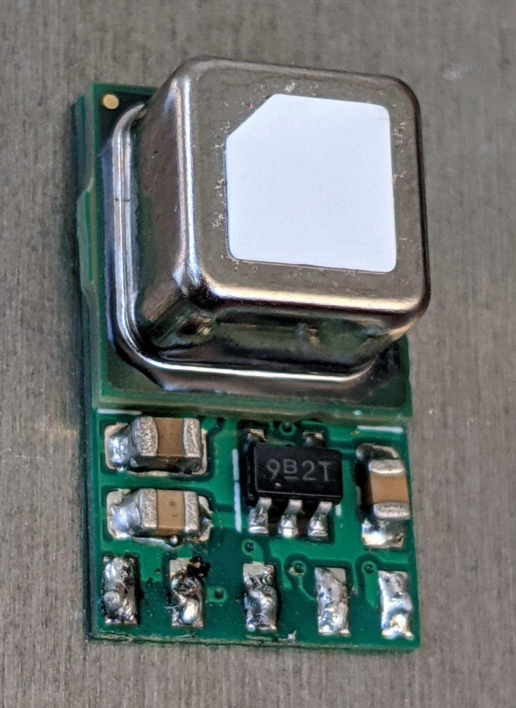

watchy-co2-pcb
==============
A small 10.3mm x 17mm PCB to mount the
[Sensirion SCD40/41 CO₂ sensor](https://www.sensirion.com/en/environmental-sensors/carbon-dioxide-sensors/carbon-dioxide-sensor-scd4x/)
on.  It contains footprints to optionally add a
[3.3v LDO regulator](https://www.njr.com/electronic_device/PDF/NJM2881_NJM2882_E.pdf)
and some extra capacitors to better decouple the
power supply.

This board is designed to be used with the
[Watchy](https://watchy.sqfmi.com/) Open Source E-Paper Watch.
A matching case can be found at
[cscott/watchy-co2-case](https://github.com/cscott/watchy-co2-case#readme),
and a watchface using this board can be found at
[cscott/watchy-c4](https://github.com/cscott/watchy-c4#readme),

When wiring to Watchy, the SCL/SDA/GND inputs should be wired to the
appropriate test points on the Watchy PCB back, as shown below.

For Vin, there are three options:

1. The Vin input can be connected to the +3V3 test point above, with
JP1 in its default UNREG position.  This shares the 3.3V power supply
with the main ESP32.  It may (or may not) be too noisy for best SCD40
accuracy.

2. The Vin input can be connected directly to the battery +BATT at
one of the positions highlighted in pink below. JP1 would be left in
its default UNREG position.  This provides the best battery efficiency
(the SCD40 can tolerate the higher voltage level), but (depending on
the battery internal resistance) again may be too noisy for best SCD40
accuracy.  However, this is the configuration I have used in the watches
I've assembled.

3. The Vin input can be connected directly to the battery +BATT as
above, and JP1 moved to its alternate REG position.  This powers the
SCD40 by its own dedicated LDO regulator, ensuring the quietest
possible power supply.  In this configuration you can swap JP2 as well
to its GPIO0 position and wire up the GPIO0 input to control the power
to the SCD40.  See the pink highlight below for the test point location
which provides access to GPIO0.

The CP1 and CP3 capacitors will provide useful decoupling in all three
configurations, although (depending on noise measurements) they may
not be required.  All three capacitors and U2 are required in
configuration three.

Here's a [digikey link](https://www.digikey.com/short/t87dq9r9) for all
components.

Note that this board will work with the lower-cost SCD40 sensor, and gets
about a day of battery life in this configuration with the stock Watchy
battery, reading CO₂ levels every 30 seconds.  The slightly more expensive
SCD41 sensor has the exact same pinout and footprint, but contains a
lower-power mode where it can read the sensor every 5 minutes instead,
and power consumption drops from 3.2mA to 0.5mA. (In October 2021 the SCD42
was added to the product lineup which is also footprint-compatible, but
this part drops the low power modes and requires 15mA which would make
it incompatible with wearable use.)

This board was designed using [KiCad 5](https://www.kicad.org/).

(See also [this doc from TI](https://www.ti.com/lit/an/scaa048/scaa048.pdf)
on decoupling techniques using a ferrite bead if further noise reduction
is necessary.  The
[Sensirion datasheet for the SCD40](https://www.sensirion.com/fileadmin/user_upload/customers/sensirion/Dokumente/9.5_CO2/Sensirion_CO2_Sensors_SCD4x_Datasheet.pdf) suggests less than 30mV of power supply noise.)

### More photos of installed board

Note that I've connected GPIO in these photos, even though I'm not using
regulator (I'm using power option 2).  I also added an extra capacitor,
whose high side is *supposed* to be connected to pins 5 and 6 of the CP2104
to fix the dreaded "USB death" problem of the first release of the Watchy,
but instead (due to a confusion I had about the `PWR_FLAG` symbol on the
Watchy schematic, it's connected across the input to U2, the watchy voltage
regulator -- which could *also* use a capacitor to stabilize the regulator,
but wasn't what I was intending to do...

I also had issues with the watchy button switches popping open because
they are not supported on the bottom side; the orangish bits of
plastic in these photos are my impromptu shims to allow the bottom
side of the switches to be supported by the bottom case half.

